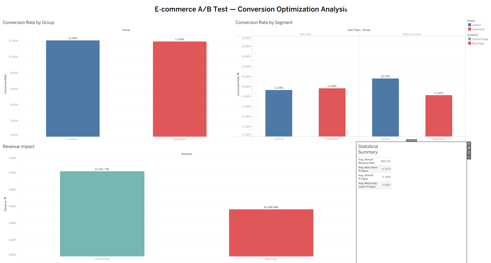

## 📌 Project Overview

A multi-dimensional A/B test analysis conducted on an e-commerce platform to evaluate whether a **redesigned landing page** drives higher conversion rates compared to the existing design.

Rather than stopping at aggregate results, this study applies **segmentation analysis** across user behavioral dimensions — uncovering a critical insight that top-level metrics completely missed: the new design **actively harms conversion rates among returning users**, putting an estimated **$548,332 in annual revenue at risk.**

---

## 🎯 Business Question

> *"Does the new landing page design statistically improve conversion rates — and does this hold across all user segments?"*

---
## 📊 Interactive Dashboard
🔗 [View Live Tableau Dashboard](https://public.tableau.com/app/profile/maksim.chudakov2280/vizzes)
## 🖼 Dashboard Preview


## 📊 Key Findings

| Dimension | Result |
|---|---|
| Dataset Size | 290,584 clean user sessions |
| Aggregate Result | ❌ Not significant (p = 0.19) |
| New User Segment | ❌ Not significant (p = 0.74) |
| Returning User Segment | ✅ Significant negative effect (p = 0.028) |
| Conversion Impact | -0.37% drop for returning users |
| Annual Revenue at Risk | $548,332 |

---
123
## 🔍 The Core Insight

The aggregate A/B test returned an **inconclusive result** — suggesting no meaningful difference between the two pages. However, segmentation analysis revealed a critical divergence:

- **New Users** — No significant impact from the new design
- **Returning Users** — Statistically significant **conversion rate decline** of 0.37%

This is a classic example of how **top-level metrics can mask opposing segment-level effects** — and why segmentation is essential before any deployment decision.

---

## 💡 Final Recommendation

> **Do not launch the new landing page globally.** Implement a segmented experience — preserve the current page for returning users and conduct qualitative research to understand friction points before the next experiment iteration.

---

## 🛠 Tech Stack

| Layer | Tools |
|---|---|
| Data Processing | Python, Pandas, NumPy |
| Statistical Testing | SciPy, Statsmodels |
| Visualization | Matplotlib, Seaborn |
| Business Dashboard | Tableau Public |

---

## 📂 Project Structure
```
ecommerce-ab-test-analysis/
│
├── ab_analysis.ipynb              # Main analysis notebook
├── ab_test_dashboard.twbx         # Tableau packaged workbook
├── data/
│   └── ab_data.csv                # Raw dataset
├── visuals/
│   ├── eda_overview.png
│   ├── hypothesis_testing.png
│   ├── segmentation_analysis.png
│   ├── executive_dashboard.png
│   └── executive_Tableau_dashboard.png
└── README.md
```
---

## 📋 Analytical Framework

| Phase | Description |
|---|---|
| Phase 1 | Data Ingestion & Preliminary Validation |
| Phase 2 | Data Cleaning & Integrity Audit |
| Phase 3 | Exploratory Data Analysis (EDA) |
| Phase 4 | Hypothesis Testing & Statistical Analysis |
| Phase 5 | Segmentation Analysis |
| Phase 6 | Business Recommendations & Revenue Impact |

## 🧪 Statistical Methods Applied

- ✅ Two-Proportion Z-Test
- ✅ Chi-Square Test of Independence
- ✅ Cohen's h Effect Size
- ✅ Statistical Power Analysis
- ✅ Multi-Segment Subgroup Analysis
- ✅ Revenue Impact Modeling

---

## 📁 Dataset

**Source:** [A/B Testing Dataset — Kaggle](https://www.kaggle.com/datasets/zhangluyuan/ab-testing)

| Field | Description |
|---|---|
| user_id | Unique user identifier |
| timestamp | Session timestamp |
| group | Control or Treatment assignment |
| landing_page | Old or new page served |
| converted | Binary conversion outcome (0/1) |

---
